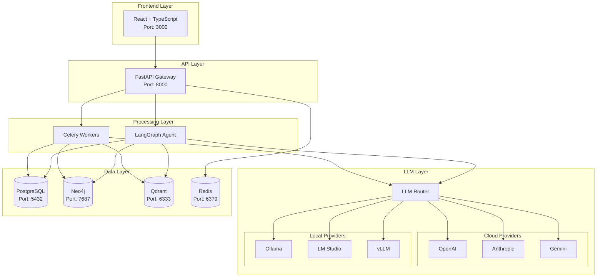
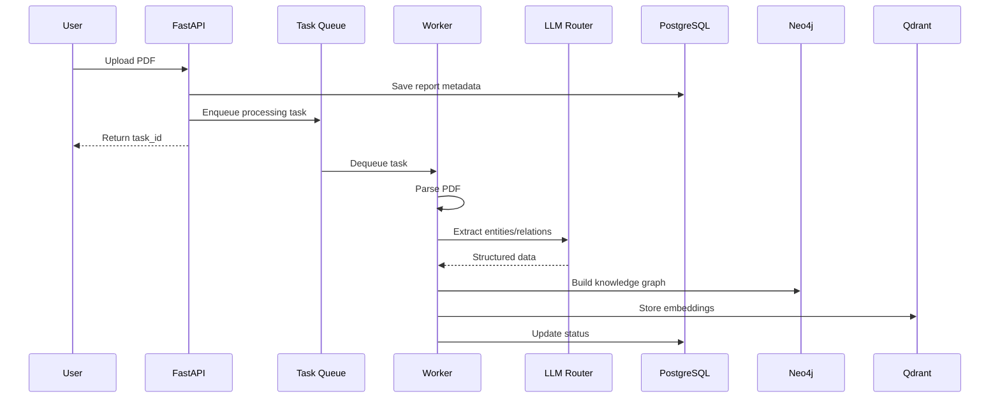
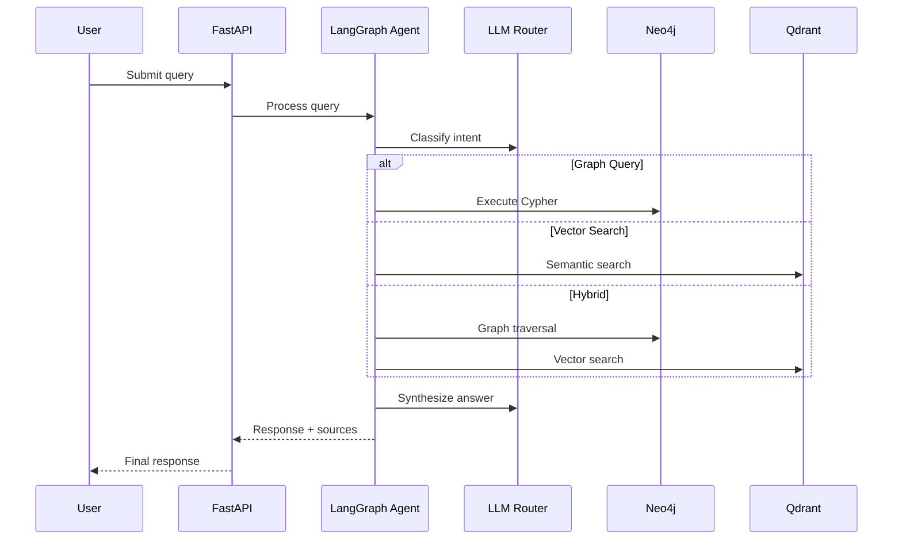
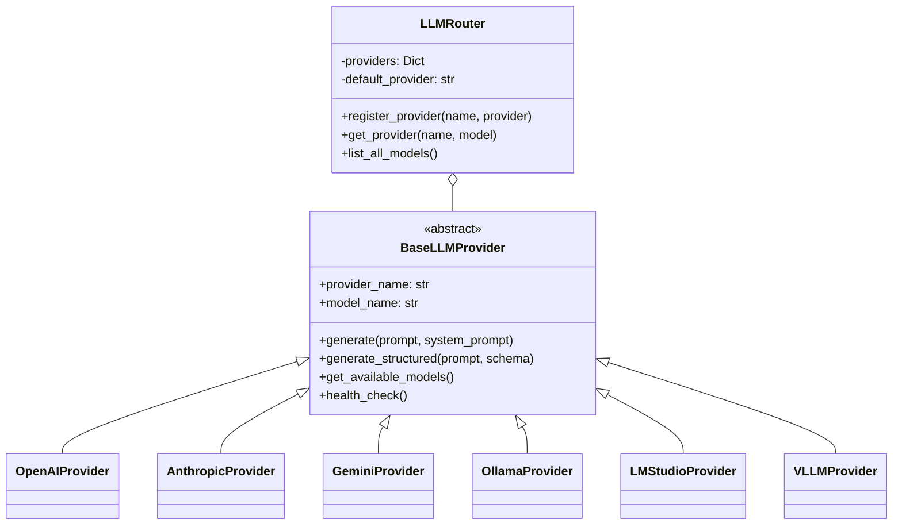
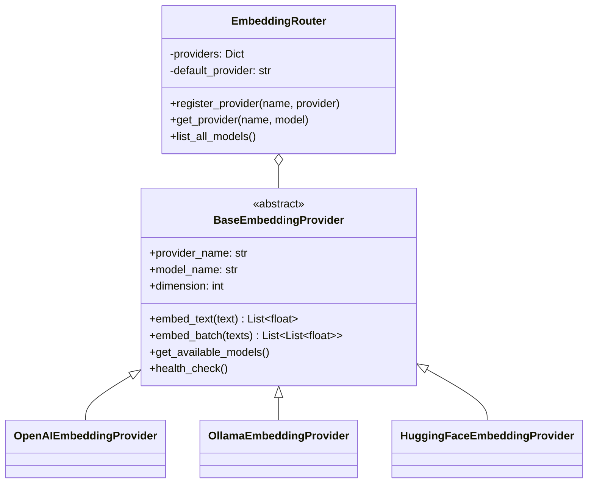

# GraphRAG 증권 리포트 분석 서비스 개발 계획

## 1. 프로젝트 개요

PRD 기반 GraphRAG 증권 리포트 심층 분석 서비스의 MVP 개발 계획

### 핵심 요구사항
- **Vector DB**: Qdrant
- **Graph DB**: Neo4j
- **Relational DB**: PostgreSQL
- **Backend**: FastAPI + Python 3.11+
- **Frontend**: React + TypeScript
- **LLM Orchestration**: LangChain + LangGraph
- **프롬프트 관리**: YAML 기반 중앙 집중식 관리
- **LLM Provider**: 클라우드(Gemini, OpenAI, Anthropic) + 로컬(Ollama, LM Studio, vLLM) 지원

---

## 2. 시스템 아키텍처

### 2.1 High-Level Architecture



### 2.2 Ingestion Pipeline



### 2.3 Query Pipeline



---

## 3. 프로젝트 구조

```
stock-rags/
├── docker-compose.yml
├── docker-compose.dev.yml
├── .env.example
├── Makefile
│
├── backend/
│   ├── Dockerfile
│   ├── pyproject.toml
│   ├── alembic/
│   └── app/
│       ├── main.py
│       ├── config.py
│       ├── api/v1/
│       │   ├── reports.py
│       │   ├── chat.py
│       │   ├── graph.py
│       │   └── models.py
│       ├── db/
│       │   ├── postgres.py
│       │   ├── neo4j.py
│       │   ├── qdrant.py
│       │   └── redis.py
│       ├── llm/                    # LLM Provider 추상화
│       │   ├── base.py
│       │   ├── router.py
│       │   └── providers/
│       │       ├── openai.py
│       │       ├── anthropic.py
│       │       ├── gemini.py
│       │       ├── ollama.py
│       │       ├── lmstudio.py
│       │       └── vllm.py
│       ├── prompts/                # 프롬프트 중앙 관리
│       │   ├── loader.py
│       │   └── templates/
│       │       ├── extraction/
│       │       │   ├── entity_extraction.yaml
│       │       │   └── relation_extraction.yaml
│       │       └── reasoning/
│       │           ├── intent_classification.yaml
│       │           ├── cypher_generation.yaml
│       │           └── answer_synthesis.yaml
│       ├── agents/                 # LangGraph 에이전트
│       │   ├── graph_builder.py
│       │   ├── state.py
│       │   └── nodes/
│       ├── services/
│       │   ├── extraction_service.py
│       │   ├── graph_service.py
│       │   └── search_service.py
│       ├── workers/
│       │   ├── celery_app.py
│       │   └── tasks/
│       └── parsers/
│           └── pdf_parser.py
│
├── frontend/                   # React + TypeScript + MUI
│   ├── Dockerfile
│   ├── package.json
│   └── src/
│       ├── api/
│       ├── components/
│       │   ├── reports/
│       │   ├── chat/
│       │   ├── graph/          # react-force-graph 사용
│       │   └── settings/
│       └── pages/
│
├── config/
│   ├── neo4j/init.cypher
│   └── prometheus/
│
└── tests/
```

---

## 4. 데이터베이스 스키마

### 4.1 PostgreSQL

```sql
-- Reports
CREATE TABLE reports (
    id UUID PRIMARY KEY DEFAULT gen_random_uuid(),
    filename VARCHAR(255) NOT NULL,
    file_hash VARCHAR(64) UNIQUE NOT NULL,
    title VARCHAR(500),
    report_type VARCHAR(50),
    publish_date DATE,
    security_firm VARCHAR(100),
    analyst_name VARCHAR(100),
    status VARCHAR(50) DEFAULT 'pending',
    page_count INTEGER,
    entity_count INTEGER DEFAULT 0,
    created_at TIMESTAMP WITH TIME ZONE DEFAULT NOW()
);

-- Entities
CREATE TABLE entities (
    id UUID PRIMARY KEY DEFAULT gen_random_uuid(),
    report_id UUID REFERENCES reports(id) ON DELETE CASCADE,
    entity_type VARCHAR(50) NOT NULL,
    name VARCHAR(255) NOT NULL,
    normalized_name VARCHAR(255),
    properties JSONB DEFAULT '{}',
    confidence_score FLOAT DEFAULT 1.0,
    neo4j_node_id VARCHAR(100)
);

-- Conversations
CREATE TABLE conversations (
    id UUID PRIMARY KEY DEFAULT gen_random_uuid(),
    title VARCHAR(255),
    created_at TIMESTAMP WITH TIME ZONE DEFAULT NOW()
);

-- Messages
CREATE TABLE messages (
    id UUID PRIMARY KEY DEFAULT gen_random_uuid(),
    conversation_id UUID REFERENCES conversations(id) ON DELETE CASCADE,
    role VARCHAR(20) NOT NULL,
    content TEXT NOT NULL,
    provider VARCHAR(50),
    model VARCHAR(100),
    sources JSONB DEFAULT '[]',
    graph_data JSONB,
    created_at TIMESTAMP WITH TIME ZONE DEFAULT NOW()
);

-- LLM Settings
CREATE TABLE llm_settings (
    id UUID PRIMARY KEY DEFAULT gen_random_uuid(),
    default_provider VARCHAR(50) DEFAULT 'openai',
    default_model VARCHAR(100) DEFAULT 'gpt-4o',
    provider_settings JSONB DEFAULT '{}'
);
```

### 4.2 Neo4j Ontology

```cypher
// Node Types
// - Company: ticker, name, aliases
// - Industry: name, parent_industry
// - Theme: name, keywords
// - Report: report_id, title, publish_date
// - SecurityFirm: name
// - Analyst: name
// - TargetPrice: value, date, change_type
// - Opinion: rating, date, previous_rating

// Relationship Types
// (Company)-[:BELONGS_TO]->(Industry)
// (Company)-[:RELATED_TO {relation_type}]->(Theme)
// (Company)-[:HAS_TARGET_PRICE]->(TargetPrice)
// (Company)-[:HAS_OPINION]->(Opinion)
// (Company)-[:SUPPLIES_TO {product}]->(Company)
// (Company)-[:COMPETES_WITH]->(Company)
// (Company)-[:MENTIONED_IN]->(Report)
// (Report)-[:AUTHORED_BY]->(Analyst)
// (Report)-[:PUBLISHED_BY]->(SecurityFirm)

// Indexes
CREATE INDEX company_ticker FOR (c:Company) ON (c.ticker);
CREATE INDEX company_name FOR (c:Company) ON (c.name);
CREATE INDEX report_date FOR (r:Report) ON (r.publish_date);
CREATE FULLTEXT INDEX company_search FOR (c:Company) ON EACH [c.name, c.aliases_text];
```

### 4.3 Qdrant Collections

```python
# report_chunks collection
{
    "name": "report_chunks",
    "vectors_config": {
        "size": 1536,  # OpenAI embedding dimension
        "distance": "Cosine"
    },
    "payload_schema": {
        "report_id": "keyword",
        "chunk_index": "integer",
        "text": "text",
        "page_number": "integer",
        "company_ticker": "keyword",
        "report_type": "keyword"
    }
}
```

---

## 5. LLM/Embedding Provider 추상화 설계

### 5.1 LLM Provider



### 5.2 Embedding Provider (LLM과 동일한 패턴)



**임베딩 모델도 프로바이더 기반 선택:**
- OpenAI: text-embedding-3-small, text-embedding-3-large
- Ollama: nomic-embed-text, mxbai-embed-large
- HuggingFace: multilingual-e5-large, Ko-sRoBERTa 등
- 사용자가 프로바이더 등록 후 모델 선택 가능

---

## 6. 프롬프트 관리 시스템

### YAML 템플릿 구조

```yaml
# prompts/templates/extraction/entity_extraction.yaml
metadata:
  name: entity_extraction
  version: "1.0.0"

variables:
  - name: text
    required: true
  - name: report_type
    default: "stock_analysis"

system_prompt: |
  You are a financial analyst expert...

user_prompt: |
  Extract entities from:
  Report Type: {report_type}
  Text: {text}

output_schema:
  type: object
  properties:
    companies: {...}
    target_prices: {...}
```

### Prompt Loader

```python
class PromptLoader:
    def load(self, template_path: str) -> PromptTemplate
    def render(self, template_path: str, variables: dict) -> tuple[str, str]
```

---

## 7. 개발 로드맵

### Phase 1: Foundation (2주)

| Week | Tasks | Deliverables |
|------|-------|--------------|
| 1 | Docker 환경, DB 스키마, Health check | docker-compose.yml, migrations |
| 2 | LLM 추상화, 프롬프트 시스템, 기본 API | llm/, prompts/, /models 엔드포인트 |

**검증 기준:**
- 모든 서비스 docker-compose up으로 정상 실행
- `/health/ready` 엔드포인트에서 모든 DB 연결 확인
- LLM provider 테스트 통과

**완료 리포트:** Phase 1 완료 후 `docs/phase1-report.md` 작성

---

### Phase 2: Ingestion Pipeline (3주)

| Week | Tasks | Deliverables |
|------|-------|--------------|
| 3 | PDF 파싱, 메타데이터 추출, Celery 설정 | parsers/, workers/ |
| 4 | 엔티티 추출 프롬프트, 추출 서비스 | extraction prompts, ExtractionService |
| 5 | 그래프 빌딩, 벡터 저장, 파이프라인 통합 | GraphService, 전체 파이프라인 |

**검증 기준:**
- PDF 업로드 → 처리 완료까지 End-to-End 테스트
- 엔티티 추출 정밀도 85% 이상 (10건 샘플)
- Neo4j, Qdrant에 데이터 정상 저장 확인

**완료 리포트:** Phase 2 완료 후 `docs/phase2-report.md` 작성

---

### Phase 3: Query Engine (3주)

| Week | Tasks | Deliverables |
|------|-------|--------------|
| 6 | Intent 분류, LangGraph 에이전트 구조 | agents/, IntentClassifier |
| 7 | Cypher 생성, Graph/Vector 검색 노드 | GraphQuerier, VectorSearcher |
| 8 | 답변 합성, Chat API | AnswerSynthesizer, /chat 엔드포인트 |

**검증 기준:**
- Intent 분류 정확도 90% (graph/vector/hybrid)
- 10개 샘플 질의에 대한 답변 품질 평가 (1-5점, 평균 3.5 이상)
- 응답 시간 15초 이내

**완료 리포트:** Phase 3 완료 후 `docs/phase3-report.md` 작성

---

### Phase 4: Frontend MVP (2주)

| Week | Tasks | Deliverables |
|------|-------|--------------|
| 9 | React 설정, 리포트 관리 UI, 모델 선택 | Reports, Settings 페이지 |
| 10 | 채팅 UI, 그래프 시각화, 통합 테스트 | Chat, GraphExplorer 페이지 |

**검증 기준:**
- 전체 사용자 플로우 E2E 테스트 통과
- UI 반응 시간 3초 이내
- 그래프 시각화 정상 동작

**완료 리포트:** Phase 4 완료 후 `docs/phase4-report.md` 및 `docs/mvp-final-report.md` 작성

---

## 8. MVP 범위 정리

### 포함

| 기능 | 우선순위 |
|------|----------|
| PDF 업로드/파싱 | P0 |
| 엔티티/관계 추출 | P0 |
| 지식 그래프 구축 | P0 |
| 벡터 임베딩 저장 | P0 |
| Intent 분류 | P0 |
| Graph/Vector/Hybrid 검색 | P0 |
| 답변 합성 | P0 |
| 출처 인용 | P1 |
| 그래프 시각화 (react-force-graph) | P1 |
| 모델 선택 UI (LLM + Embedding) | P1 |

### 프론트엔드 기술 스택

- **UI 프레임워크**: React + TypeScript + MUI (Material-UI)
- **그래프 시각화**: react-force-graph
- **상태 관리**: Zustand 또는 Redux Toolkit
- **HTTP 클라이언트**: Axios

### 제외 (향후 버전)

- 실시간 스트리밍 응답 (v1.1)
- 차트/이미지 추출 (v1.2)
- OCR (v1.1)
- 사용자 인증 (v1.1)
- 실시간 주가 연동 (v1.2)
- 알림 시스템 (v1.2)

---

## 9. 주요 API 엔드포인트

| Method | Endpoint | 설명 |
|--------|----------|------|
| GET | `/api/v1/health` | Health check |
| POST | `/api/v1/reports/upload` | PDF 업로드 |
| GET | `/api/v1/reports/{id}/status` | 처리 상태 |
| GET | `/api/v1/reports` | 리포트 목록 |
| POST | `/api/v1/chat` | 질의응답 |
| GET | `/api/v1/chat/conversations` | 대화 목록 |
| GET | `/api/v1/graph/entities` | 엔티티 검색 |
| GET | `/api/v1/graph/companies/{ticker}/timeline` | 투자의견 이력 |
| GET | `/api/v1/models` | 사용 가능 모델 목록 |
| PUT | `/api/v1/models/default` | 기본 모델 설정 |

---

## 10. 환경 변수 (.env.example)

```bash
# PostgreSQL
POSTGRES_HOST=postgres
POSTGRES_PORT=5432
POSTGRES_DB=stockrags
POSTGRES_USER=stockrags
POSTGRES_PASSWORD=secret

# Neo4j
NEO4J_URI=bolt://neo4j:7687
NEO4J_USER=neo4j
NEO4J_PASSWORD=secret

# Qdrant
QDRANT_HOST=qdrant
QDRANT_PORT=6333

# Redis
REDIS_URL=redis://redis:6379/0
CELERY_BROKER_URL=redis://redis:6379/1

# LLM - Cloud
OPENAI_API_KEY=sk-...
DEFAULT_OPENAI_MODEL=gpt-4o
ANTHROPIC_API_KEY=sk-ant-...
DEFAULT_ANTHROPIC_MODEL=claude-3-5-sonnet-20241022
GOOGLE_API_KEY=...
DEFAULT_GEMINI_MODEL=gemini-1.5-pro

# LLM - Local
OLLAMA_BASE_URL=http://host.docker.internal:11434
DEFAULT_OLLAMA_MODEL=llama3.1:70b
LMSTUDIO_BASE_URL=http://host.docker.internal:1234/v1
VLLM_BASE_URL=http://host.docker.internal:8080

# Embedding
EMBEDDING_PROVIDER=openai
EMBEDDING_MODEL=text-embedding-3-small
EMBEDDING_DIMENSION=1536
```

---

## 11. Phase 완료 리포트 템플릿

```markdown
# Phase X 완료 리포트

## 완료 항목
- [ ] 항목 1
- [ ] 항목 2

## 테스트 결과
- 단위 테스트: X passed
- 통합 테스트: X passed
- E2E 테스트: X passed

## 성능 지표
| 지표 | 목표 | 실제 |
|------|------|------|
| ... | ... | ... |

## 알려진 이슈
1. 이슈 1: [설명, 영향, 완화 방안]

## 회고
### 잘된 점
### 개선할 점
### 다음 Phase를 위한 액션 아이템
```

---

## 12. 핵심 구현 파일

1. `backend/app/llm/base.py` - LLM Provider 추상화 기본 클래스
2. `backend/app/llm/router.py` - Provider 라우팅 로직
3. `backend/app/prompts/loader.py` - 프롬프트 로딩/렌더링
4. `backend/app/agents/graph_builder.py` - LangGraph 에이전트 정의
5. `backend/app/services/extraction_service.py` - 엔티티/관계 추출 서비스
